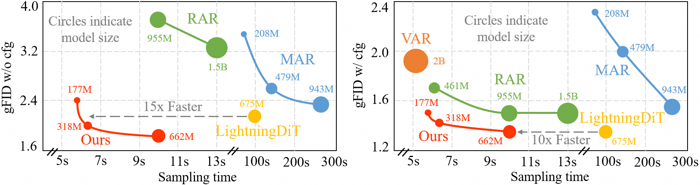

# AliTok: Towards Sequence Modeling Alignment between Tokenizer and Autoregressive Model


<p align="center">
     <br />
    <em> 
    </em>
</p>


## 📎 Paper Link <a name="1"></a> 

* AliTok: Towards Sequence Modeling Alignment between Tokenizer and Autoregressive Model

    Authors: Pingyu Wu, Kai Zhu, Yu Liu, Longxiang Tang, Jian Yang, Yansong Peng, Wei Zhai, Yang Cao, Zheng-Jun Zha

## 💡 Abstract <a name="2"></a> 
Autoregressive image generation aims to predict the next token based on previous ones. However, existing image tokenizers encode tokens with bidirectional dependencies during the compression process, which hinders the effective modeling by autoregressive models. In this paper, we propose a novel Aligned Tokenizer (AliTok), which utilizes a causal decoder to establish unidirectional dependencies among encoded tokens, thereby aligning the token modeling approach between the tokenizer and autoregressive model. Furthermore, by incorporating prefix tokens and employing two-stage tokenizer training to enhance reconstruction consistency, AliTok achieves great reconstruction performance while being generation-friendly. On ImageNet-256 benchmark, using a standard decoder-only autoregressive model as the generator with only 177M parameters, AliTok achieves a gFID score of 1.50 and an IS of 305.9. When the parameter count is increased to 662M, AliTok achieves a gFID score of 1.35, surpassing the state-of-the-art diffusion method with 10x faster sampling speed.


<p align="center">
     <br />
    <em> 
    </em>
</p>


## ✏️ Usage <a name="4"></a> 

### Download Trained Models <a name="41"></a> 

You can download all trained models [here](https://drive.google.com/drive/folders/1dBjcFfClmBvf2cSlelFMT2gMlS8OQOHG?usp=sharing), including the [tokenizer weight](https://drive.google.com/file/d/1Rir4QEJ_HTvZkhcnw9MTfWlSFemcGVIW/view?usp=drive_link) and the autoregressive model weights as listed below:

| AR Model | FID | IS | #Params | 
|-----------|---------|-------|---------|
| [AliTok-B](https://drive.google.com/file/d/1PNVX9wqePxRjuOKpt4iw6CpIYLlyJWlX/view?usp=sharing) | 1.50    | 305.9  | 177M    |
| [AliTok-L](https://drive.google.com/file/d/1tmwAa724pNY4FgUsLne2VJVGoK_TBuMa/view?usp=drive_link) | 1.42    | 326.6    | 318M    |
| [AliTok-XL](https://drive.google.com/file/d/1Vu0UsQfqzZ8HMKFqE2tIGdAcJ6zPXvFd/view?usp=drive_link) | 1.35    | 318.8    | 662M    |

You need to place these weight files, including both the tokenizer weight and autoregressive model weights, in the `weights` folder.

Download the VIRTUAL_imagenet256_labeled.npz file for testing
```
wget https://openaipublic.blob.core.windows.net/diffusion/jul-2021/ref_batches/imagenet/256/VIRTUAL_imagenet256_labeled.npz
```

### Evaluation (ImageNet 256x256) <a name="42"></a> 
Reproducing AliTok-B
```bash  
torchrun --nnodes=1 --nproc_per_node=8  sample_imagenet.py config=configs/alitok_b.yaml experiment.output_dir="output/alitok_b"  experiment.generator_checkpoint="weights/alitok_b.bin"  

python3 guided-diffusion/evaluations/evaluator.py VIRTUAL_imagenet256_labeled.npz output/alitok_b.npz
```


Reproducing AliTok-L
```bash  
torchrun --nnodes=1 --nproc_per_node=8  sample_imagenet.py config=configs/alitok_l.yaml experiment.output_dir="output/alitok_l"  experiment.generator_checkpoint="weights/alitok_l.bin"  

python3 guided-diffusion/evaluations/evaluator.py VIRTUAL_imagenet256_labeled.npz output/alitok_l.npz
```

Reproducing AliTok-XL
```bash  
torchrun --nnodes=1 --nproc_per_node=8  sample_imagenet.py config=configs/alitok_xl.yaml experiment.output_dir="output/alitok_xl"  experiment.generator_checkpoint="weights/alitok_xl.bin"  

python3 guided-diffusion/evaluations/evaluator.py VIRTUAL_imagenet256_labeled.npz output/alitok_xl.npz
```


### Training Autoregressive Models <a name="42"></a> 
Cache tokenizer encoding results
```bash  
torchrun --nnodes=1 --nproc_per_node=8 --node_rank=0 pretokenization.py --img_size 256 --batch_size 32 --ten_crop --data_path ${PATH_TO_IMAGENET}
```

Reproduce AliTok-B (800 epochs, per_gpu_batch=128)
```bash  
export NUM_PROCESSES="16"
WANDB_MODE=offline accelerate launch --num_machines=${WORLD_SIZE} --num_processes=${NUM_PROCESSES} \
--same_network --machine_rank=${RANK} --main_process_ip=${MASTER_ADDR} --main_process_port=${MASTER_PORT}  train_ar.py config=configs/alitok_b.yaml  experiment.output_dir="alitok_b"
```

Reproduce AliTok-L (800 epochs, per_gpu_batch=64)
```bash  
export NUM_PROCESSES="32"
WANDB_MODE=offline accelerate launch --num_machines=${WORLD_SIZE} --num_processes=${NUM_PROCESSES} \
--same_network --machine_rank=${RANK} --main_process_ip=${MASTER_ADDR} --main_process_port=${MASTER_PORT}  train_ar.py config=configs/alitok_l.yaml  experiment.output_dir="alitok_l"
```

Reproduce AliTok-XL (400 epochs, per_gpu_batch=32)
```bash  
export NUM_PROCESSES="64"
WANDB_MODE=offline accelerate launch --num_machines=${WORLD_SIZE} --num_processes=${NUM_PROCESSES} \
--same_network --machine_rank=${RANK} --main_process_ip=${MASTER_ADDR} --main_process_port=${MASTER_PORT}  train_ar.py config=configs/alitok_xl.yaml  experiment.output_dir="alitok_xl"
```

## ⛺ Acknowledgements <a name="5"></a> 
A large portion of codes in this repo is based on [TiTok](https://github.com/bytedance/1d-tokenizer), [RAR](https://github.com/bytedance/1d-tokenizer), [MAR](https://github.com/LTH14/mar), [LlamaGen](https://github.com/FoundationVision/LlamaGen). We are grateful for these amazing open-source research projects.


## ✉️ Statement <a name="6"></a> 
For any other questions please contact [wpy364755620@mail.ustc.edu.cn](wpy364755620@mail.ustc.edu.cn).


